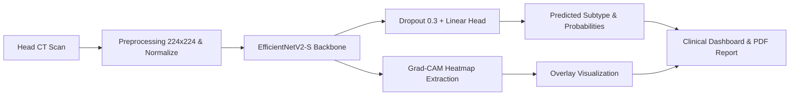

# 🧠 AI-Based Intracranial Hemorrhage Detection & Subtype Classification

[](https://intracranial-hemorrhage-detection0804.streamlit.app/)
[](https://github.com/asmi-2005/Intracranial-Hemorrhage-Detection)
[](https://pytorch.org/)
[](https://www.python.org/downloads/)
[](https://opensource.org/licenses/MIT)

An end-to-end deep learning clinical decision-support application for detecting and classifying **Intracranial Hemorrhage (ICH)** from non-contrast head CT slices, powered by **EfficientNetV2-S**, **Grad-CAM explainable AI**, and an interactive **Streamlit** dashboard.

---

## 📋 Table of Contents
- [Overview](#-overview)
- [Hemorrhage Subtypes Classified](#-hemorrhage-subtypes-classified)
- [Key Features](#-key-features)
- [Model Architecture & Explainability](#-model-architecture--explainability)
- [Project Structure](#-project-structure)
- [Local Installation & Setup](#-local-installation--setup)
- [Deploying to Streamlit Community Cloud](#-deploying-to-streamlit-community-cloud)
- [Clinical Disclaimer](#-clinical-disclaimer)

---

## 🔍 Overview
Intracranial hemorrhage (ICH) is a critical medical emergency where bleeding occurs inside the skull or brain tissue. Rapid diagnosis is paramount to prevent permanent neurological deficits or death. This system analyzes non-contrast head CT scan slices to:
1. Identify the presence or absence of hemorrhage.
2. Differentiate between five specific hemorrhage subtypes.
3. Highlight suspect anatomical regions with Gradient-weighted Class Activation Mapping (**Grad-CAM**).
4. Provide structured clinical risk metrics and downloadable diagnostic reports.

---

## 🎯 Hemorrhage Subtypes Classified
The multi-class classifier diagnoses CT scan slices across 6 distinct categories:

| Subtype | Abbreviation | Clinical Description |
| :--- | :--- | :--- |
| **No Hemorrhage** | Normal | Healthy brain parenchyma without intracranial bleed |
| **Epidural** | EDH | Bleeding between the skull inner table and outer dura mater |
| **Intraparenchymal** | IPH | Bleeding within the brain tissue / parenchyma |
| **Subdural** | SDH | Bleeding between the dura mater and arachnoid mater |
| **Intraventricular** | IVH | Bleeding inside the ventricular system of the brain |
| **Subarachnoid** | SAH | Bleeding into the subarachnoid space surrounding the brain |

---

## ✨ Key Features
- **Instant CT Scan Inference**: Upload your own head CT slice (JPG, JPEG, PNG) or select from pre-loaded clinical demonstration scans.
- **Explainable AI (Grad-CAM)**: Visual heatmap overlay showing the exact brain regions influencing the model's prediction.
- **Risk Stratification & Clinical Guidance**: Automated categorization (Low, Moderate, High risk) paired with triage recommendations.
- **PDF Report Generation**: Export clinical analysis reports with scan metadata, confidence levels, and Grad-CAM visualizations.
- **Session Analytics**: Live tracker of evaluated normal vs. abnormal scans.

---

## 🧠 Model Architecture & Explainability
- **Backbone**: `EfficientNetV2-S` pretrained on ImageNet and fine-tuned on non-contrast head CT scans.
- **Loss Function**: Weighted Cross-Entropy Loss to address medical class imbalance.
- **Patient-Level Stratification**: Dataset split strictly at the patient level (70% Train, 15% Val, 15% Test) to guarantee zero data leakage between slices of the same patient.
- **Interpretability**: PyTorch Grad-CAM registered on the final convolutional layer (`model.features[-1]`).



---

## 📂 Project Structure
```
Intracranial_Hemorrhage_Detection/
├── app/
│   └── app.py                       # Streamlit clinical dashboard application
├── sample_images/                   # Pre-loaded CT scans for instant demo testing
│   ├── normal_sample.jpg
│   ├── intraparenchymal_sample.jpg
│   ├── epidural_sample.jpg
│   └── subdural_sample.jpg
├── src/
│   ├── models/
│   │   └── model.py                 # EfficientNetV2-S HemorrhageClassifier
│   ├── preprocessing/               # Data ingestion, splitting, and PyTorch datasets
│   ├── training/                    # Model training pipeline
│   ├── evaluation/                  # Metric evaluation & demo inference
│   ├── explainability/              # Standalone Grad-CAM generator
│   └── utils/
│       └── config.py                # Configuration and hyperparameter settings
├── outputs/
│   ├── models/
│   │   └── efficientnetv2_best.pth  # Trained model weights (used for inference)
│   └── plots/                       # Confusion matrices and training curves
├── .streamlit/
│   └── config.toml                  # Streamlit dark theme and server settings
├── requirements.txt                 # Production Python dependencies
├── packages.txt                     # Linux system dependencies for Streamlit Cloud
└── README.md                        # Project documentation
```

---

## 💻 Local Installation & Setup

### 1. Clone the Repository
```bash
git clone https://github.com/asmi-2005/Intracranial-Hemorrhage-Detection.git
cd Intracranial-Hemorrhage-Detection
```

### 2. Create and Activate a Virtual Environment
```bash
# Windows
python -m venv venv
.\venv\Scripts\activate

# Linux / macOS
python3 -m venv venv
source venv/bin/activate
```

### 3. Install Dependencies
```bash
pip install -r requirements.txt
```

### 4. Run the Streamlit Dashboard
```bash
streamlit run app/app.py
```
Open your browser at `http://localhost:8501`.

---

## 🚀 Deploying to Streamlit Community Cloud

Deploying this application to **Streamlit Community Cloud** is free and takes less than 2 minutes:

### Option A: 1-Click Direct Deployment
Click the badge below to automatically prefill the Streamlit deployment settings:

[](https://share.streamlit.io/deploy?repository=asmi-2005/Intracranial-Hemorrhage-Detection&branch=main&mainModule=app/app.py)

### Option B: Manual Setup
1. Go to [share.streamlit.io](https://share.streamlit.io) and log in with your GitHub account.
2. Click **"New app"** (or **"Create app"**).
3. Fill in the deployment details:
   - **Repository**: `asmi-2005/Intracranial-Hemorrhage-Detection`
   - **Branch**: `main`
   - **Main file path**: `app/app.py`
4. Click **"Deploy!"**.

Streamlit Cloud will automatically detect `requirements.txt` and `packages.txt`, install dependencies, load model weights on CPU, and launch your live application with a public URL!

---

## ⚠️ Clinical Disclaimer
This system is an **experimental AI research demonstration** and is **NOT** a certified medical diagnostic device. It should not be used as the sole basis for clinical diagnosis or treatment decisions. Always consult a qualified radiologist or physician for medical interpretation.
